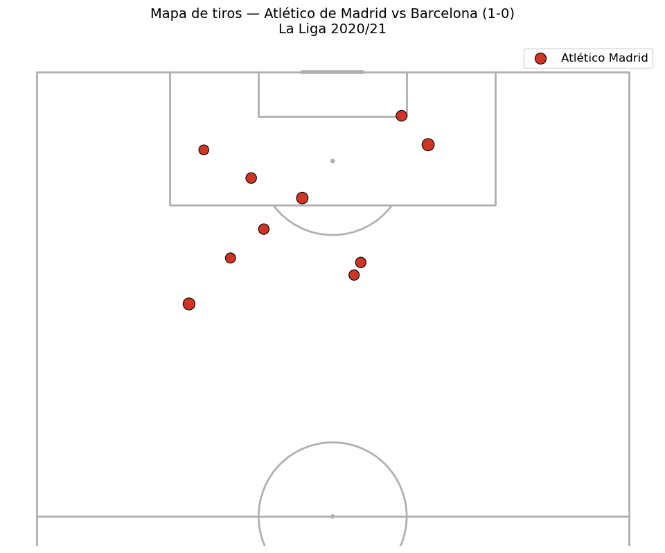
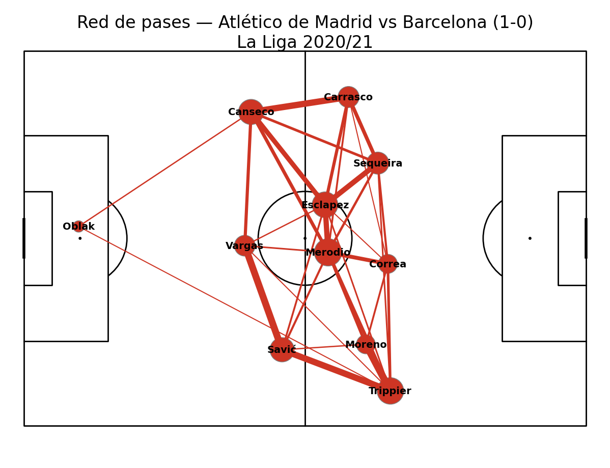
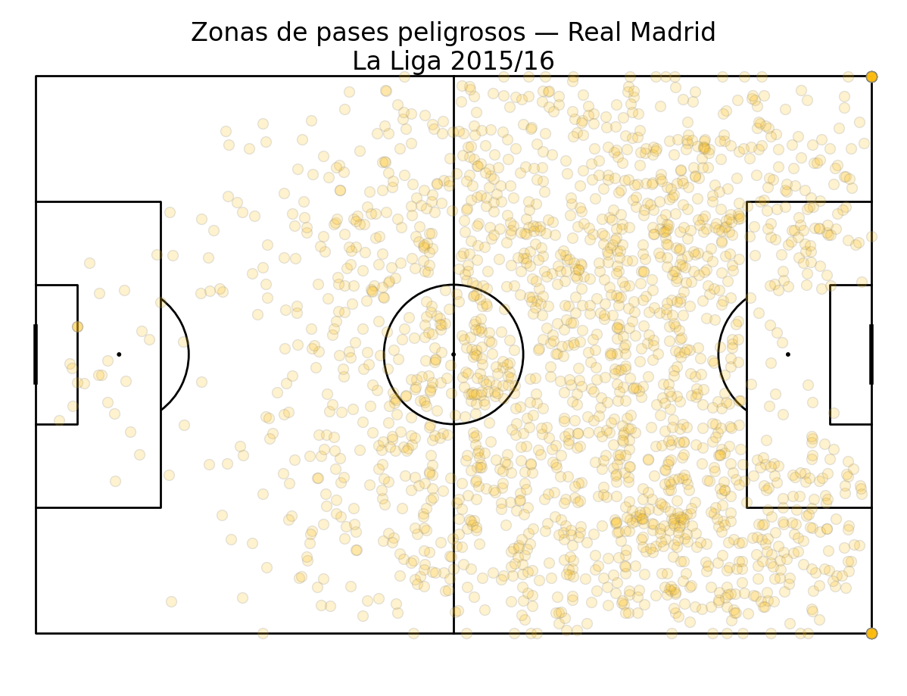
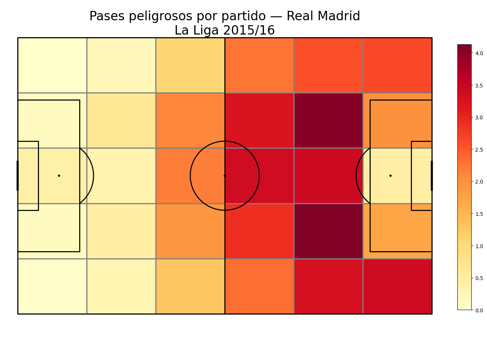
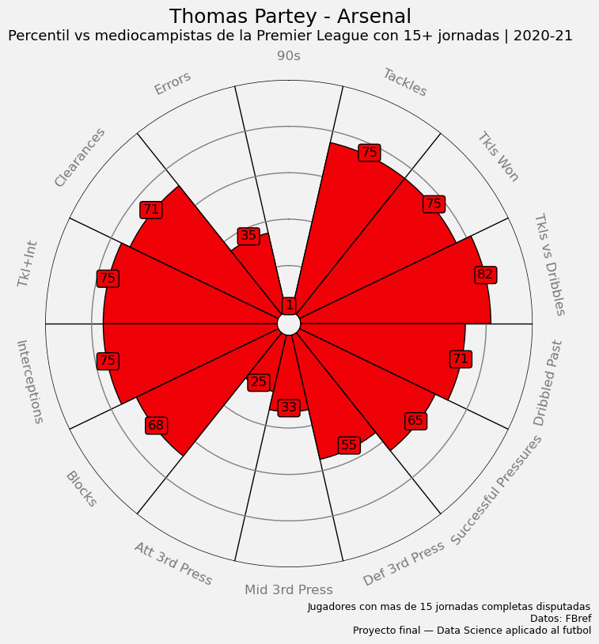
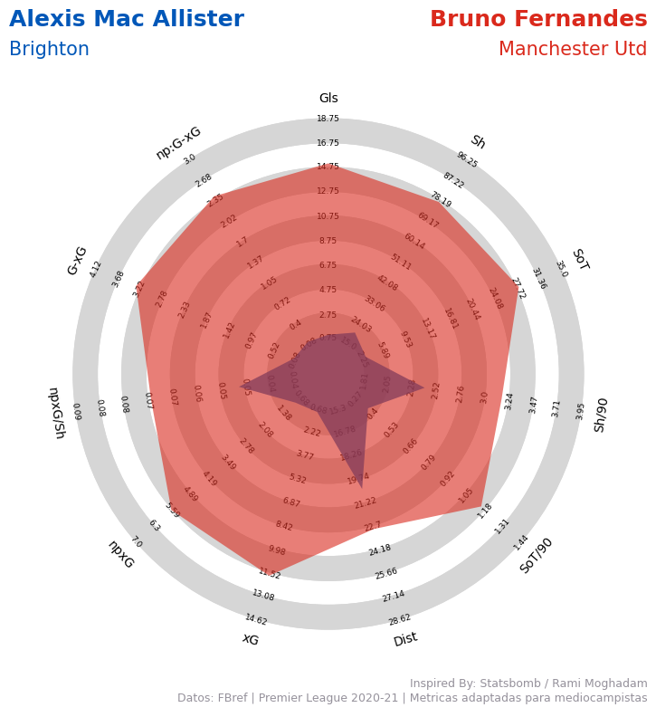
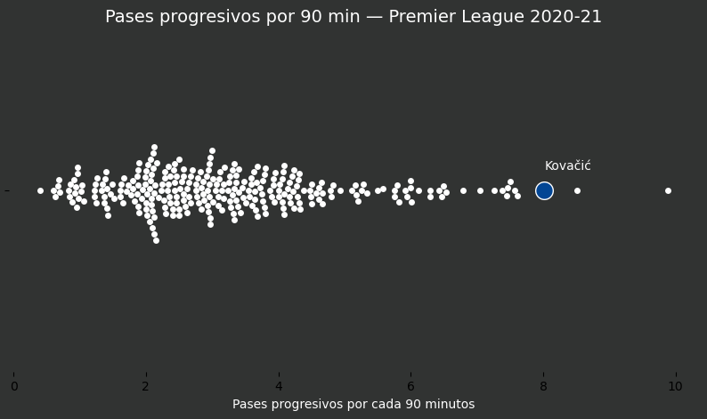
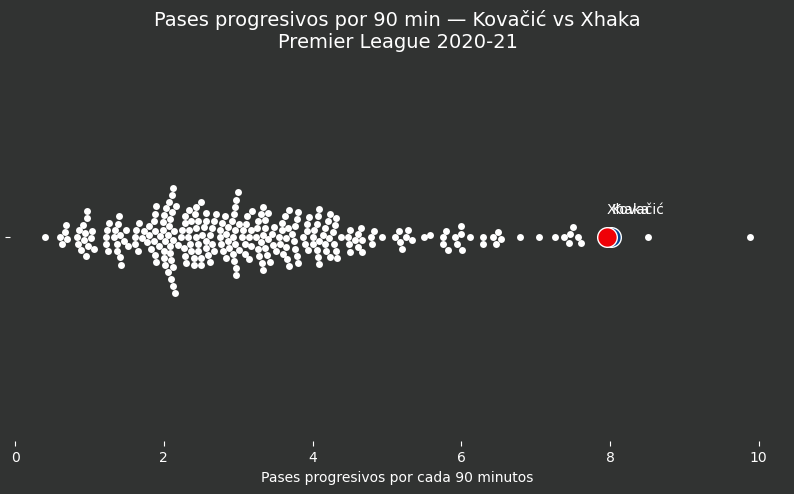
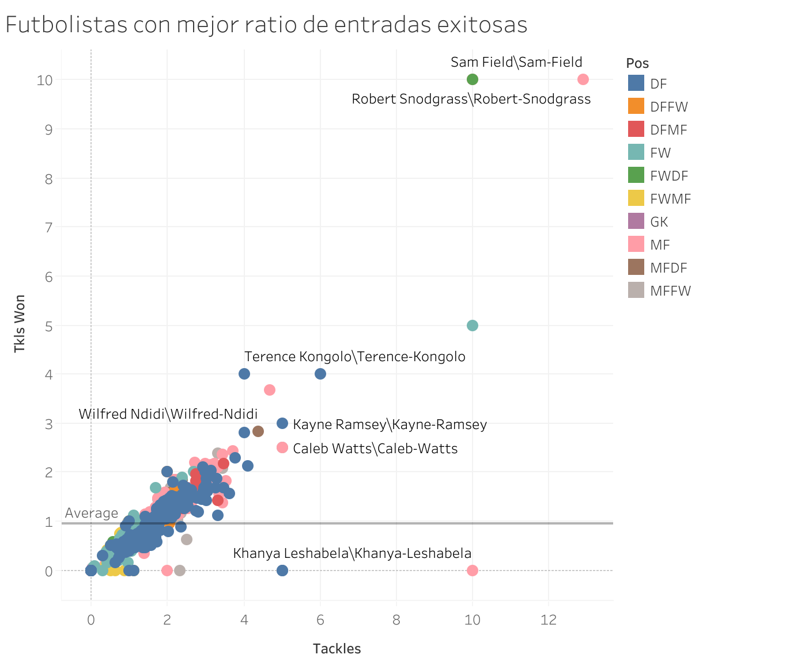
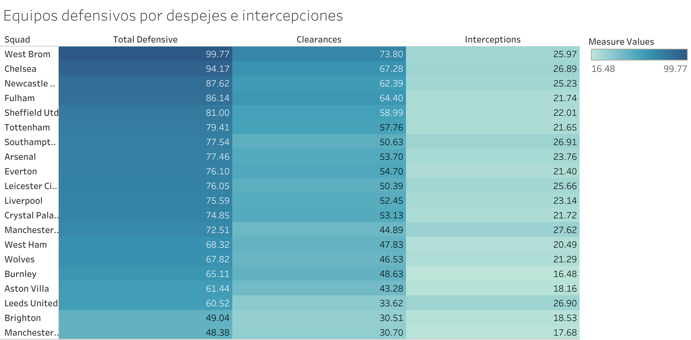

# Análisis Táctico y de Rendimiento Deportivo

## Introducción

En la actualidad, la integración del análisis de datos en la metodología de los cuerpos técnicos resulta indispensable. La percepción cualitativa del juego se complementa ahora con métricas objetivas que permiten auditar el rendimiento táctico y físico con precisión. Este informe prescinde de la complejidad estadística cruda para ofrecer conclusiones tácticas directas, aplicables al análisis de rivales y a la evaluación del propio equipo.

El objetivo principal de este documento es servir de puente entre la analítica avanzada y el trabajo en el campo de juego. Buscamos demostrar cómo las herramientas visuales (tales como mapas de calor, redes de pases, gráficos de radar y diagramas de enjambre) pueden respaldar decisiones tácticas, evaluar el rendimiento de jugadores clave y desglosar el estilo de juego de un equipo de élite.

Analizaremos escenarios tácticos específicos: desde la efectividad en bloque bajo del Atlético de Madrid y la ocupación de espacios del Real Madrid, hasta el impacto defensivo y creativo de mediocampistas referenciales en la Premier League. Cada sección proporciona conclusiones operativas diseñadas para enriquecer el criterio de entrenadores, analistas y direcciones deportivas.

---

## Seccion 1: Efectividad Ofensiva y Selección de Tiro (Mapa de Tiros)
**Encuentro:** [Atlético de Madrid 1-0 Barcelona | La Liga 2020/2021 (21 de noviembre de 2020)](https://www.youtube.com/watch?v=l_O5J2tvBg4)

### La Letalidad del Contragolpe Colchonero
El mapa de tiros expone la alta rentabilidad del planteamiento reactivo diseñado por Diego Simeone. Cediendo la iniciativa (46% de posesión), el Atlético de Madrid priorizó la calidad sobre la cantidad de las finalizaciones. Generaron 10 remates frente a los 13 del FC Barcelona, demostrando que la efectividad ofensiva no siempre requiere un volumen alto de posesión. El gol de Yannick Carrasco (45+3'), originado tras un error en salida de Ter Stegen, capitalizó a la perfección la estrategia de presión selectiva y transiciones rápidas. Además, las finalizaciones de media distancia de jugadores como Saúl y Llorente evidencian la orden de finalizar jugadas para evitar contraataques y aprovechar espacios transitorios sin sobrepoblar el área rival.

    
     
    <i>Imagen 1: Mapa de tiros del Atlético de Madrid, mostrando efectividad frente al arco.</i>

---

## Seccion 2: Estructura de Distribución de Balón (Red de Pases)
**Encuentro:** [Atlético de Madrid 1-0 Barcelona | La Liga 2020/2021 (21 de noviembre de 2020)](https://www.youtube.com/watch?v=l_O5J2tvBg4)

### El Cerrojo Táctico de Simeone
La red de pases confirma la estructura de un bloque bajo extremadamente denso y organizado. Las conexiones más sólidas (trazos gruesos) se concentran en la base de la jugada, entre los centrales y Koke, garantizando la seguridad en el primer tercio y atrayendo la presión rival. El equipo renunció casi por completo a la elaboración en la zona medular adversaria; una vez recuperado el balón, el objetivo primordial fue activar rutas de pase directas y verticales hacia João Félix y Carrasco. Este gráfico ilustra un modelo defensivo que no solo neutraliza los espacios interiores del rival, sino que utiliza su propio repliegue como trampolín para el contragolpe.

    
     
    <i>Imagen 2: Red de Pases del Atlético de Madrid, evidenciando un bloque bajo y rutas de contragolpe.</i>

---

## Seccion 3: Zonas de Generación de Peligro (Mapa de Calor)
**Equipo:** Real Madrid | La Liga 2015/2016

### El Vértigo y la Verticalidad del Madrid
El análisis espacial del Real Madrid (15/16) revela un modelo de juego marcadamente proactivo y de transiciones rápidas hacia campo contrario. Las zonas de mayor intensidad en el mapa de calor no se ubican en la base de la jugada, indicando que el equipo minimizaba la posesión defensiva para instalarse velozmente en campo rival. La amplitud ofensiva es notable por ambos carriles, pero el epicentro de la generación de peligro se sitúa en el carril central, específicamente en la frontal del área. Desde este sector, perfiles como Modrić y Kroos operaron como distribuidores clave, filtrando balones y garantizando que el volumen de ataque se tradujera en situaciones reales de finalización.

    
     
    <i>Imagen 3: Mapa general de calor del Real Madrid.</i>

 

    
     
    <i>Imagen 4: Detalle zonal de pases peligrosos y asistencias.</i>

---

## Seccion 4: Perfil Box-to-Box y Equilibrio Defensivo (Radar de Percentiles)
**Jugador Analizado:** Thomas Partey (Arsenal) | Premier League 2020/2021

### Thomas Partey: El Pulpo del Mediocampo
La evaluación de perfiles posicionales a través de gráficos de radar permite cuantificar el impacto invisible de un mediocentro defensivo. En el caso de Thomas Partey (Arsenal), la visualización lo ubica en los percentiles más altos de la liga en métricas de destrucción de juego: recuperaciones, *tackles* ganados, intercepciones y bloqueos. Este volumen de acciones defensivas certifica su rol como estabilizador del sistema. Al sostener individualmente el eje central y barrer amplias zonas del campo, Partey proporciona la red de seguridad necesaria para que los volantes creativos y los laterales se proyecten al ataque con menores riesgos estructurales en las transiciones defensivas.

    
     
    <i>Imagen 5: Radar de Percentiles (Pizza plot) destacando las estadísticas defensivas de Thomas Partey.</i>

---

## Seccion 5: Producción Creativa (Comparativa de Radares)
**Jugadores Analizados:** Bruno Fernandes (Man. Utd) vs Alexis Mac Allister (Brighton)

### Dos Formas de Ser el Dueño del Equipo
La comparativa de mediocampistas ofensivos expone dos roles divergentes dentro de la creación de juego. Bruno Fernandes (Manchester United) refleja un perfil de volumen absoluto: monopoliza las fases de ataque, acumulando altísimos registros en xG (goles esperados), tiros y asistencias, respaldado por una gran cantidad de minutos y una libertad táctica casi total. En contraste, Alexis Mac Allister (Brighton) presenta un radar más contenido en volumen pero de una eficiencia altísima por intervención. Mientras Fernandes es el eje por el que transita obligatoriamente cada ataque, Mac Allister funcionó como un catalizador táctico: participando menos, pero aportando claridad y soluciones de alto impacto cada vez que el balón pasó por sus pies.

    
     
    <i>Imagen 6: Gráfico Radar Comparativo enfrentando el estilo de Bruno Fernandes vs Alexis Mac Allister.</i>

---

## Seccion 6: Vías de Progresión Sostenida (Distribución Beeswarm)
**Jugadores Analizados:** Mateo Kovačić (Chelsea) y Granit Xhaka (Arsenal)

### Rompiendo Líneas: Conducción vs. Visión de Juego
El avance del balón hacia el tercio ofensivo es un indicador clave del dominio territorial. Los diagramas de distribución (Beeswarm) confirman que Mateo Kovačić y Granit Xhaka operaban en la élite de la Premier League en 'pases progresivos cada 90 minutos', pero ejecutaban esta progresión mediante perfiles técnicos distintos. Kovačić superaba líneas de presión principalmente a través de la conducción dinámica, rompiendo marcas con el balón controlado. Xhaka, por su parte, lograba una progresión equivalente apoyándose en su visión periférica y precisión en el pase, filtrando balones rasos o realizando cambios de orientación para desajustar el bloque rival. Identificar estas vías de progresión es fundamental para diseñar planes de presión (pressing) adaptados a las características del distribuidor rival.

    
     
    <i>Imagen 7: Gráfico de Enjambre (Beeswarm) de pases progresivos centrado en Mateo Kovačić.</i>

 

    
     
    <i>Imagen 8: Gráfico de Enjambre ampliado que evalúa y compara a Kovačić y Granit Xhaka contra toda la Premier League.</i>

---

## Seccion 7: Análisis Visual Interactivo (Tableau) - Entradas y Eficiencia Defensiva
**Herramienta:** Tableau | Múltiples Posiciones y Equipos

### Sacrificio Físico y Bloques de Supervivencia
El análisis agregado a nivel de liga permite detectar tendencias tácticas colectivas e identificar rendimientos individuales atípicos. 

A nivel individual (Imagen 9), la relación entre entradas intentadas y ganadas revela qué mediocampistas asumen la mayor carga de duelos defensivos. Mientras la media general se estabiliza en volúmenes bajos, los *outliers* (como Sam Field) registran picos extraordinarios de éxito en los duelos. Identificar estos perfiles es vital para las direcciones deportivas en la captación de talento especializado en la contención.

    
     
    <i>Imagen 9: Gráfico de Dispersión en Tableau de robos de balón, detectando "Outliers" en la liga.</i>

 

A nivel colectivo (Imagen 10), el volumen de despejes e intercepciones actúa como una radiografía del modelo de juego. Equipos reactivos (ej. West Bromwich) acumulan un altísimo número de despejes, confirmando su tendencia a ceder la iniciativa y defender en bloque bajo dentro de su propia área. En el espectro opuesto, equipos proactivos y dominadores de la posesión (como Manchester City o Brighton) registran mínimos defensivos en su propio tercio, evidenciando que su primera línea de defensa comienza con la presión tras pérdida en campo rival, alejando el peligro de su portería.

    
     
    <i>Imagen 10: Heatmap en Tableau evidenciando las acciones defensivas según cada equipo de la liga.</i>

---

## Conclusión

El análisis de datos aplicado al fútbol de alto rendimiento demuestra que las observaciones tácticas empíricas ganan solidez cuando se respaldan con evidencia cuantitativa. Como se evidencia en este reporte, el éxito competitivo se alcanza a través de múltiples modelos: desde la eficacia reactiva y el control del espacio sin balón (Atlético de Madrid), hasta el dominio territorial proactivo (Real Madrid y Manchester City), pasando por la influencia determinante de perfiles específicos en el centro del campo.

La integración de estas herramientas de visualización en la rutina de los cuerpos técnicos representa una ventaja competitiva sustancial. Permite traducir volúmenes masivos de datos en informes ejecutivos visuales, facilitando la transmisión clara de conceptos tácticos a los jugadores, auditando el rendimiento del equipo de forma objetiva y mejorando la calidad en la toma de decisiones estratégicas para la preparación de partidos y el diseño de plantillas.
